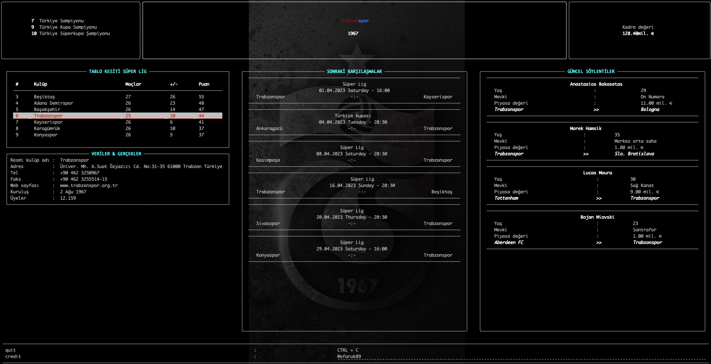
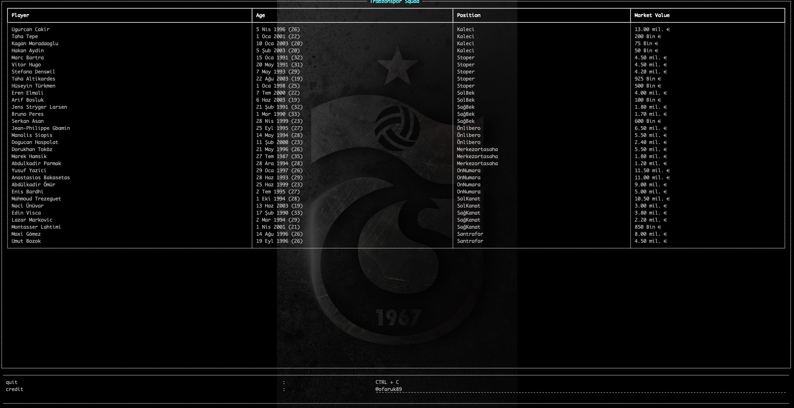
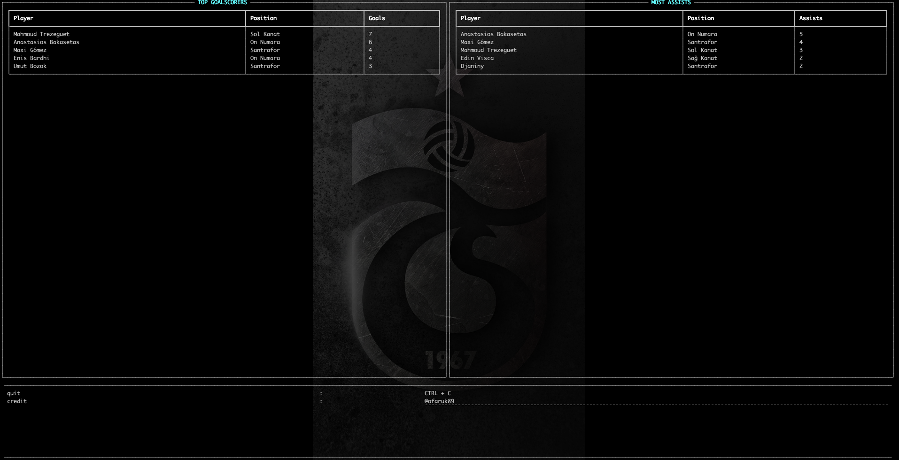

# Trabzonspor

Trabzonspor CLI!

## Installation

```shell
$ pip install trabzonspor
```

## Usage
Main Page
```
$ trabzonspor
```


List of Players
```
$ trabzonspor -kadro
```


List of Top Scorers
```
$ trabzonspor -stats
```
